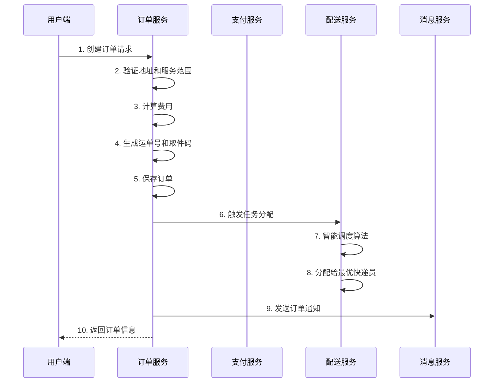
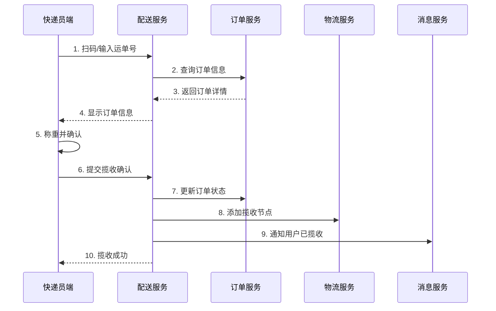

# 设计文档

## 概述

顺丰速运小程序平台采用微服务架构，包含三个前端应用和多个后端微服务。系统设计目标是支持10万并发用户，提供高可用、高性能的快递物流服务。

### 技术栈

**前端:**
- 用户端小程序: uni-app (微信小程序)
- 快递员端APP: uni-app (iOS/Android)
- 运营端Web: Vue 3 + Element Plus

**后端:**
- 框架: Go-Kratos 微服务框架
- 数据库: PostgreSQL 14 (主数据库) + MySQL (兼容)
- 缓存: Redis 7 (集群模式)
- 搜索: Elasticsearch 8.5
- 消息队列: Kafka
- 链路追踪: Jaeger
- 监控: Prometheus + Grafana

### 架构原则

1. 微服务拆分：按业务领域划分服务边界
2. 数据隔离：每个服务独立数据库
3. 异步通信：使用消息队列解耦服务
4. 缓存优先：多级缓存策略
5. 服务降级：关键路径支持降级方案

## 架构设计

### 系统架构图

```
┌─────────────────────────────────────────────────────────────┐
│                        客户端层                              │
├──────────────┬──────────────┬──────────────────────────────┤
│  用户端小程序  │  快递员端APP  │      运营端Web              │
│   (uni-app)  │   (uni-app)  │   (Vue 3 + Element Plus)   │
└──────┬───────┴──────┬───────┴──────────┬──────────────────┘
       │              │                  │
       └──────────────┴──────────────────┘
                      │
              ┌───────▼────────┐
              │   API Gateway   │
              │   (Kong/Nginx)  │
              └───────┬────────┘
                      │
       ┌──────────────┼──────────────┐
       │              │              │
┌──────▼─────┐ ┌─────▼──────┐ ┌────▼──────┐
│ 用户服务    │ │  订单服务   │ │ 物流服务   │
│user-service│ │order-service│ │logistics  │
└──────┬─────┘ └─────┬──────┘ └────┬──────┘
       │              │              │
       ┌──────────────┼──────────────┐
       │              │              │
┌──────▼─────┐ ┌─────▼──────┐ ┌────▼──────┐
│ 配送服务    │ │  支付服务   │ │ 消息服务   │
│dispatch    │ │payment     │ │notification│
└──────┬─────┘ └─────┬──────┘ └────┬──────┘
       │              │              │
       └──────────────┴──────────────┘
                      │
       ┌──────────────┼──────────────┐
       │              │              │
┌──────▼─────┐ ┌─────▼──────┐ ┌────▼──────┐
│ PostgreSQL  │ │   Redis    │ │Elasticsearch│
│   (主库)    │ │  (缓存)    │ │  (搜索)    │
└────────────┘ └────────────┘ └───────────┘
```

### 微服务划分

#### 1. 用户服务 (user-service)
- 端口: 8001
- 职责: 用户注册登录、地址管理、会员体系
- 数据库: user_db
- 依赖: Redis (缓存用户信息)

#### 2. 订单服务 (order-service)
- 端口: 8002
- 职责: 订单创建、状态管理、费用计算
- 数据库: order_db
- 依赖: user-service, logistics-service, payment-service

#### 3. 物流服务 (logistics-service)
- 端口: 8003
- 职责: 物流轨迹记录、运单号生成、节点更新
- 数据库: logistics_db
- 依赖: order-service, Elasticsearch

#### 4. 配送服务 (dispatch-service)
- 端口: 8004
- 职责: 智能调度、快递员管理、任务分配
- 数据库: dispatch_db
- 依赖: order-service, Redis (位置缓存)

#### 5. 支付服务 (payment-service)
- 端口: 8005
- 职责: 支付流程、微信支付集成、对账退款
- 数据库: payment_db
- 依赖: order-service, 微信支付API

#### 6. 消息服务 (notification-service)
- 端口: 8006
- 职责: 消息推送、模板管理、通知记录
- 数据库: notification_db
- 依赖: Kafka, 微信模板消息API

## 组件和接口设计

### 前端组件架构

#### 用户端小程序组件

```
user-client/
├── pages/                    # 页面
│   ├── index/               # 首页
│   │   └── index.vue
│   ├── send/                # 寄快递
│   │   ├── index.vue        # 寄件首页
│   │   ├── create.vue       # 创建订单
│   │   ├── address.vue      # 地址列表
│   │   └── address-edit.vue # 地址编辑
│   ├── order/               # 查快递
│   │   ├── list.vue         # 订单列表
│   │   ├── detail.vue       # 订单详情
│   │   └── tracking.vue     # 物流轨迹
│   ├── user/                # 个人中心
│   │   ├── index.vue
│   │   ├── member.vue       # 会员中心
│   │   └── wallet.vue       # 钱包
│   └── login/
│       └── login.vue        # 登录页
├── components/              # 公共组件
│   ├── sf-tabbar/          # 底部导航
│   ├── sf-loading/         # 加载组件
│   ├── sf-empty/           # 空状态
│   └── sf-address-picker/  # 地址选择器
├── stores/                  # 状态管理
│   ├── user.js             # 用户状态
│   └── order.js            # 订单状态
└── utils/                   # 工具函数
    ├── request.js          # 请求封装
    ├── auth.js             # 认证工具
    └── validator.js        # 表单验证
```

#### 核心组件设计

**1. 地址选择器组件 (sf-address-picker)**
```javascript
props: {
  value: Object,          // 当前选中地址
  type: String,           // 'sender' | 'receiver'
  showMap: Boolean        // 是否显示地图
}

events: {
  change: (address) => {} // 地址变更事件
}

methods: {
  selectAddress()         // 选择地址
  editAddress()           // 编辑地址
  validateAddress()       // 验证地址
}
```

**2. 订单卡片组件 (sf-order-card)**
```javascript
props: {
  order: Object,          // 订单数据
  showActions: Boolean    // 是否显示操作按钮
}

events: {
  click: (order) => {},   // 点击卡片
  action: (type) => {}    // 操作按钮点击
}
```

### 后端服务接口设计

#### 用户服务 API

```protobuf
service UserService {
  // 微信登录
  rpc WxLogin(WxLoginRequest) returns (WxLoginReply);
  
  // 获取用户信息
  rpc GetUser(GetUserRequest) returns (GetUserReply);
  
  // 更新用户信息
  rpc UpdateUser(UpdateUserRequest) returns (UpdateUserReply);
  
  // 地址管理
  rpc ListAddresses(ListAddressesRequest) returns (ListAddressesReply);
  rpc CreateAddress(CreateAddressRequest) returns (CreateAddressReply);
  rpc UpdateAddress(UpdateAddressRequest) returns (UpdateAddressReply);
  rpc DeleteAddress(DeleteAddressRequest) returns (DeleteAddressReply);
}
```

#### 订单服务 API

```protobuf
service OrderService {
  // 创建订单
  rpc CreateOrder(CreateOrderRequest) returns (CreateOrderReply);
  
  // 查询订单列表
  rpc ListOrders(ListOrdersRequest) returns (ListOrdersReply);
  
  // 获取订单详情
  rpc GetOrder(GetOrderRequest) returns (GetOrderReply);
  
  // 取消订单
  rpc CancelOrder(CancelOrderRequest) returns (CancelOrderReply);
  
  // 计算费用
  rpc CalculateFee(CalculateFeeRequest) returns (CalculateFeeReply);
}
```

#### 物流服务 API

```protobuf
service LogisticsService {
  // 获取物流轨迹
  rpc GetTracking(GetTrackingRequest) returns (GetTrackingReply);
  
  // 添加物流节点
  rpc AddTrackingNode(AddTrackingNodeRequest) returns (AddTrackingNodeReply);
  
  // 生成运单号
  rpc GenerateWaybillNumber(GenerateWaybillNumberRequest) returns (GenerateWaybillNumberReply);
}
```

#### 配送服务 API

```protobuf
service DispatchService {
  // 获取快递员任务列表
  rpc ListTasks(ListTasksRequest) returns (ListTasksReply);
  
  // 分配任务
  rpc AssignTask(AssignTaskRequest) returns (AssignTaskReply);
  
  // 揽收确认
  rpc ConfirmPickup(ConfirmPickupRequest) returns (ConfirmPickupReply);
  
  // 派送确认
  rpc ConfirmDelivery(ConfirmDeliveryRequest) returns (ConfirmDeliveryReply);
  
  // 上报位置
  rpc ReportLocation(ReportLocationRequest) returns (ReportLocationReply);
  
  // 获取绩效
  rpc GetPerformance(GetPerformanceRequest) returns (GetPerformanceReply);
}
```

## 数据模型设计

### 核心数据表

#### 用户表 (users)

```sql
CREATE TABLE users (
    id BIGSERIAL PRIMARY KEY,
    openid VARCHAR(64) UNIQUE NOT NULL,
    nickname VARCHAR(100),
    avatar_url VARCHAR(255),
    phone VARCHAR(20),
    member_level VARCHAR(20) DEFAULT 'normal',
    points INT DEFAULT 0,
    created_at TIMESTAMPTZ NOT NULL DEFAULT NOW(),
    updated_at TIMESTAMPTZ NOT NULL DEFAULT NOW(),
    deleted_at TIMESTAMPTZ,
    
    INDEX idx_openid (openid),
    INDEX idx_phone (phone)
);
```

#### 地址表 (addresses)

```sql
CREATE TABLE addresses (
    id BIGSERIAL PRIMARY KEY,
    user_id BIGINT NOT NULL,
    name VARCHAR(50) NOT NULL,
    phone VARCHAR(20) NOT NULL,
    province VARCHAR(50) NOT NULL,
    city VARCHAR(50) NOT NULL,
    district VARCHAR(50) NOT NULL,
    detail VARCHAR(255) NOT NULL,
    company VARCHAR(100),
    tag VARCHAR(20),
    is_default BOOLEAN DEFAULT FALSE,
    latitude DECIMAL(10, 7),
    longitude DECIMAL(10, 7),
    created_at TIMESTAMPTZ NOT NULL DEFAULT NOW(),
    updated_at TIMESTAMPTZ NOT NULL DEFAULT NOW(),
    deleted_at TIMESTAMPTZ,
    
    INDEX idx_user_id (user_id),
    FOREIGN KEY (user_id) REFERENCES users(id)
);
```

#### 订单表 (orders)

```sql
CREATE TABLE orders (
    id BIGSERIAL PRIMARY KEY,
    waybill_number VARCHAR(20) UNIQUE NOT NULL,
    user_id BIGINT NOT NULL,
    
    -- 寄件信息
    sender_name VARCHAR(50) NOT NULL,
    sender_phone VARCHAR(20) NOT NULL,
    sender_address TEXT NOT NULL,
    sender_latitude DECIMAL(10, 7),
    sender_longitude DECIMAL(10, 7),
    
    -- 收件信息
    receiver_name VARCHAR(50) NOT NULL,
    receiver_phone VARCHAR(20) NOT NULL,
    receiver_address TEXT NOT NULL,
    receiver_latitude DECIMAL(10, 7),
    receiver_longitude DECIMAL(10, 7),
    
    -- 服务信息
    service_type VARCHAR(20) NOT NULL,
    weight DECIMAL(10, 2),
    volume_weight DECIMAL(10, 2),
    
    -- 费用信息
    freight_fee DECIMAL(10, 2) NOT NULL,
    insurance_fee DECIMAL(10, 2) DEFAULT 0,
    total_fee DECIMAL(10, 2) NOT NULL,
    payment_method VARCHAR(20) NOT NULL,
    
    -- 状态信息
    status VARCHAR(20) NOT NULL DEFAULT 'pending',
    pickup_code VARCHAR(6),
    courier_id BIGINT,
    
    -- 时间信息
    estimated_pickup_time TIMESTAMPTZ,
    actual_pickup_time TIMESTAMPTZ,
    estimated_delivery_time TIMESTAMPTZ,
    actual_delivery_time TIMESTAMPTZ,
    
    created_at TIMESTAMPTZ NOT NULL DEFAULT NOW(),
    updated_at TIMESTAMPTZ NOT NULL DEFAULT NOW(),
    deleted_at TIMESTAMPTZ,
    
    INDEX idx_waybill_number (waybill_number),
    INDEX idx_user_id (user_id),
    INDEX idx_courier_id (courier_id),
    INDEX idx_status (status),
    INDEX idx_created_at (created_at),
    
    FOREIGN KEY (user_id) REFERENCES users(id),
    FOREIGN KEY (courier_id) REFERENCES couriers(id)
);
```

#### 物流轨迹表 (tracking_nodes)

```sql
CREATE TABLE tracking_nodes (
    id BIGSERIAL PRIMARY KEY,
    waybill_number VARCHAR(20) NOT NULL,
    node_type VARCHAR(20) NOT NULL,
    status VARCHAR(50) NOT NULL,
    description TEXT NOT NULL,
    location VARCHAR(255),
    latitude DECIMAL(10, 7),
    longitude DECIMAL(10, 7),
    operator_id BIGINT,
    operator_name VARCHAR(50),
    node_time TIMESTAMPTZ NOT NULL,
    created_at TIMESTAMPTZ NOT NULL DEFAULT NOW(),
    
    INDEX idx_waybill_number (waybill_number),
    INDEX idx_node_time (node_time),
    
    FOREIGN KEY (waybill_number) REFERENCES orders(waybill_number)
);
```

#### 快递员表 (couriers)

```sql
CREATE TABLE couriers (
    id BIGSERIAL PRIMARY KEY,
    name VARCHAR(50) NOT NULL,
    phone VARCHAR(20) UNIQUE NOT NULL,
    employee_id VARCHAR(20) UNIQUE NOT NULL,
    status VARCHAR(20) DEFAULT 'offline',
    current_latitude DECIMAL(10, 7),
    current_longitude DECIMAL(10, 7),
    last_location_update TIMESTAMPTZ,
    rating DECIMAL(3, 2) DEFAULT 5.00,
    total_orders INT DEFAULT 0,
    created_at TIMESTAMPTZ NOT NULL DEFAULT NOW(),
    updated_at TIMESTAMPTZ NOT NULL DEFAULT NOW(),
    deleted_at TIMESTAMPTZ,
    
    INDEX idx_phone (phone),
    INDEX idx_employee_id (employee_id),
    INDEX idx_status (status)
);
```

#### 快递员任务表 (courier_tasks)

```sql
CREATE TABLE courier_tasks (
    id BIGSERIAL PRIMARY KEY,
    courier_id BIGINT NOT NULL,
    order_id BIGINT NOT NULL,
    task_type VARCHAR(20) NOT NULL,
    priority INT DEFAULT 0,
    status VARCHAR(20) NOT NULL DEFAULT 'pending',
    assigned_at TIMESTAMPTZ NOT NULL DEFAULT NOW(),
    accepted_at TIMESTAMPTZ,
    completed_at TIMESTAMPTZ,
    created_at TIMESTAMPTZ NOT NULL DEFAULT NOW(),
    updated_at TIMESTAMPTZ NOT NULL DEFAULT NOW(),
    
    INDEX idx_courier_id (courier_id),
    INDEX idx_order_id (order_id),
    INDEX idx_status (status),
    INDEX idx_priority (priority),
    
    FOREIGN KEY (courier_id) REFERENCES couriers(id),
    FOREIGN KEY (order_id) REFERENCES orders(id)
);
```

### 数据模型关系图

```
users (1) ──────< (N) addresses
  │
  │ (1)
  │
  ▼ (N)
orders ──────> (N) tracking_nodes
  │
  │ (N)
  │
  ▼ (1)
couriers (1) ──────< (N) courier_tasks
```

## 核心业务流程设计

### 1. 用户下单流程



### 2. 快递员揽收流程



### 3. 智能调度算法

```
输入: 新订单 order
输出: 最优快递员 courier

算法步骤:
1. 获取订单取件地址坐标 (lat, lng)
2. 查询附近5公里内的在线快递员列表
3. 对每个快递员计算匹配分数:
   
   score = w1 * distance_score + 
           w2 * load_score + 
           w3 * performance_score
   
   其中:
   - distance_score = 1 - (distance / 5000)
   - load_score = 1 - (current_tasks / max_tasks)
   - performance_score = rating / 5.0
   - w1=0.5, w2=0.3, w3=0.2 (权重)

4. 选择分数最高的快递员
5. 如果没有可用快递员，加入待分配队列
6. 推送任务给快递员
```

### 4. 费用计算引擎

```go
// 费用计算逻辑
type FeeCalculator struct {
    ServiceType string
    Weight      float64
    Distance    float64
    Insurance   float64
}

func (f *FeeCalculator) Calculate() *FeeResult {
    // 1. 基础运费计算
    baseRate := getBaseRate(f.ServiceType)
    continuedRate := getContinuedRate(f.ServiceType)
    
    freightFee := baseRate
    if f.Weight > 1.0 {
        continuedWeight := math.Ceil(f.Weight - 1.0)
        freightFee += continuedWeight * continuedRate
    }
    
    // 2. 距离加价
    if f.Distance > 100 {
        distanceFee := (f.Distance - 100) / 100 * 2.0
        freightFee += distanceFee
    }
    
    // 3. 保价费计算
    insuranceFee := 0.0
    if f.Insurance > 0 {
        insuranceFee = math.Max(1.0, f.Insurance * 0.005)
    }
    
    // 4. 总费用
    totalFee := freightFee + insuranceFee
    
    return &FeeResult{
        FreightFee:   freightFee,
        InsuranceFee: insuranceFee,
        TotalFee:     totalFee,
    }
}

// 服务类型费率表
var serviceRates = map[string]struct{
    BaseRate      float64
    ContinuedRate float64
}{
    "instant":  {BaseRate: 20.0, ContinuedRate: 8.0},  // 即日
    "express":  {BaseRate: 15.0, ContinuedRate: 6.0},  // 特快
    "standard": {BaseRate: 12.0, ContinuedRate: 5.0},  // 标快
    "economy":  {BaseRate: 8.0,  ContinuedRate: 3.0},  // 包裹
}
```

### 5. 订单状态机

```
订单状态流转:

pending (待接单)
    ↓
assigned (已分配)
    ↓
accepted (已接单)
    ↓
picked_up (已揽收)
    ↓
in_transit (运输中)
    ↓
out_for_delivery (派送中)
    ↓
delivered (已签收)

异常状态:
- cancelled (已取消)
- exception (异常)
- returned (退回)

状态转换规则:
- pending → assigned: 系统自动分配
- assigned → accepted: 快递员接单
- accepted → picked_up: 快递员揽收
- picked_up → in_transit: 到达转运中心
- in_transit → out_for_delivery: 到达目的地网点
- out_for_delivery → delivered: 快递员派送完成
- 任意状态 → cancelled: 用户/系统取消
- 任意状态 → exception: 发生异常
```

## 错误处理设计

### 错误码规范

```go
// 错误码定义
const (
    // 通用错误 (1000-1999)
    ErrInvalidParam     = 1001  // 参数错误
    ErrUnauthorized     = 1002  // 未授权
    ErrForbidden        = 1003  // 禁止访问
    ErrNotFound         = 1004  // 资源不存在
    ErrInternalServer   = 1005  // 服务器内部错误
    
    // 用户相关 (2000-2999)
    ErrUserNotFound     = 2001  // 用户不存在
    ErrUserExists       = 2002  // 用户已存在
    ErrInvalidToken     = 2003  // Token无效
    ErrTokenExpired     = 2004  // Token过期
    
    // 订单相关 (3000-3999)
    ErrOrderNotFound    = 3001  // 订单不存在
    ErrOrderCancelled   = 3002  // 订单已取消
    ErrOrderCompleted   = 3003  // 订单已完成
    ErrInvalidAddress   = 3004  // 地址无效
    ErrOutOfService     = 3005  // 超出服务范围
    
    // 支付相关 (4000-4999)
    ErrPaymentFailed    = 4001  // 支付失败
    ErrRefundFailed     = 4002  // 退款失败
    ErrInsufficientBalance = 4003  // 余额不足
    
    // 配送相关 (5000-5999)
    ErrNoCourierAvailable = 5001  // 无可用快递员
    ErrTaskNotFound       = 5002  // 任务不存在
    ErrInvalidPickupCode  = 5003  // 取件码错误
)
```

### 错误处理中间件

```go
func ErrorHandler() middleware.Middleware {
    return func(handler middleware.Handler) middleware.Handler {
        return func(ctx context.Context, req interface{}) (interface{}, error) {
            resp, err := handler(ctx, req)
            
            if err != nil {
                // 记录错误日志
                log.Error("request failed",
                    "error", err,
                    "path", extractPath(ctx),
                    "method", extractMethod(ctx))
                
                // 转换为标准错误响应
                return nil, convertToStandardError(err)
            }
            
            return resp, nil
        }
    }
}

// 标准错误响应
type ErrorResponse struct {
    Code    int    `json:"code"`
    Message string `json:"message"`
    Details string `json:"details,omitempty"`
}
```

### 重试策略

```go
// 指数退避重试
func RetryWithBackoff(fn func() error, maxRetries int) error {
    var err error
    for i := 0; i < maxRetries; i++ {
        err = fn()
        if err == nil {
            return nil
        }
        
        // 判断是否可重试
        if !isRetryable(err) {
            return err
        }
        
        // 指数退避: 2^i * 100ms
        backoff := time.Duration(math.Pow(2, float64(i))) * 100 * time.Millisecond
        time.Sleep(backoff)
    }
    return err
}

// 可重试错误判断
func isRetryable(err error) bool {
    // 网络错误、超时错误、5xx错误可重试
    // 4xx客户端错误不可重试
    return errors.Is(err, ErrNetworkTimeout) ||
           errors.Is(err, ErrServiceUnavailable)
}
```

## 性能优化设计

### 1. 多级缓存策略

```go
// 三级缓存架构
type CacheManager struct {
    L1 *ristretto.Cache  // 本地缓存 (进程内)
    L2 *redis.Client     // Redis缓存 (分布式)
    L3 *gorm.DB          // 数据库 (持久化)
}

func (c *CacheManager) Get(ctx context.Context, key string) (interface{}, error) {
    // 1. 查询本地缓存 (L1)
    if val, found := c.L1.Get(key); found {
        return val, nil
    }
    
    // 2. 查询Redis缓存 (L2)
    val, err := c.L2.Get(ctx, key).Result()
    if err == nil {
        // 回填本地缓存
        c.L1.Set(key, val, 1)
        return val, nil
    }
    
    // 3. 查询数据库 (L3)
    var result interface{}
    err = c.L3.WithContext(ctx).Where("key = ?", key).First(&result).Error
    if err == nil {
        // 回填Redis和本地缓存
        c.L2.Set(ctx, key, result, 5*time.Minute)
        c.L1.Set(key, result, 1)
        return result, nil
    }
    
    return nil, err
}
```

### 2. 数据库优化

```sql
-- 订单表分区 (按月份)
CREATE TABLE orders_2024_01 PARTITION OF orders
    FOR VALUES FROM ('2024-01-01') TO ('2024-02-01');

CREATE TABLE orders_2024_02 PARTITION OF orders
    FOR VALUES FROM ('2024-02-01') TO ('2024-03-01');

-- 索引优化
CREATE INDEX CONCURRENTLY idx_orders_user_status 
    ON orders(user_id, status) 
    WHERE deleted_at IS NULL;

-- 物化视图 (订单统计)
CREATE MATERIALIZED VIEW order_statistics AS
SELECT 
    DATE(created_at) as date,
    status,
    COUNT(*) as count,
    SUM(total_fee) as total_amount
FROM orders
WHERE deleted_at IS NULL
GROUP BY DATE(created_at), status;

-- 定时刷新物化视图
CREATE OR REPLACE FUNCTION refresh_order_statistics()
RETURNS void AS $$
BEGIN
    REFRESH MATERIALIZED VIEW CONCURRENTLY order_statistics;
END;
$$ LANGUAGE plpgsql;
```

### 3. 连接池配置

```go
// 数据库连接池
func InitDB() *gorm.DB {
    db, err := gorm.Open(postgres.Open(dsn), &gorm.Config{
        PrepareStmt: true,  // 预编译SQL
        Logger: logger.Default.LogMode(logger.Info),
    })
    
    sqlDB, _ := db.DB()
    
    // 连接池配置
    sqlDB.SetMaxIdleConns(20)           // 最大空闲连接数
    sqlDB.SetMaxOpenConns(100)          // 最大打开连接数
    sqlDB.SetConnMaxLifetime(time.Hour) // 连接最大生命周期
    sqlDB.SetConnMaxIdleTime(10 * time.Minute) // 空闲连接最大生命周期
    
    return db
}

// Redis连接池
func InitRedis() *redis.ClusterClient {
    return redis.NewClusterClient(&redis.ClusterOptions{
        Addrs: []string{
            "redis-node1:6379",
            "redis-node2:6379",
            "redis-node3:6379",
        },
        PoolSize:     100,              // 连接池大小
        MinIdleConns: 20,               // 最小空闲连接
        MaxRetries:   3,                // 最大重试次数
        DialTimeout:  5 * time.Second,  // 连接超时
        ReadTimeout:  3 * time.Second,  // 读超时
        WriteTimeout: 3 * time.Second,  // 写超时
    })
}
```

### 4. 限流和熔断

```go
// 限流中间件 (令牌桶算法)
func RateLimiter(rate int) middleware.Middleware {
    limiter := rate.NewLimiter(rate.Limit(rate), rate*2)
    
    return func(handler middleware.Handler) middleware.Handler {
        return func(ctx context.Context, req interface{}) (interface{}, error) {
            if !limiter.Allow() {
                return nil, errors.New("rate limit exceeded")
            }
            return handler(ctx, req)
        }
    }
}

// 熔断器中间件
func CircuitBreaker() middleware.Middleware {
    cb := gobreaker.NewCircuitBreaker(gobreaker.Settings{
        Name:        "service",
        MaxRequests: 3,
        Interval:    time.Minute,
        Timeout:     30 * time.Second,
        ReadyToTrip: func(counts gobreaker.Counts) bool {
            failureRatio := float64(counts.TotalFailures) / float64(counts.Requests)
            return counts.Requests >= 10 && failureRatio >= 0.5
        },
    })
    
    return func(handler middleware.Handler) middleware.Handler {
        return func(ctx context.Context, req interface{}) (interface{}, error) {
            result, err := cb.Execute(func() (interface{}, error) {
                return handler(ctx, req)
            })
            return result, err
        }
    }
}
```

### 5. 异步处理

```go
// 消息队列处理
type OrderEventHandler struct {
    kafka *kafka.Consumer
}

func (h *OrderEventHandler) HandleOrderCreated(msg *kafka.Message) error {
    var event OrderCreatedEvent
    json.Unmarshal(msg.Value, &event)
    
    // 异步处理订单创建后的任务
    go h.assignCourier(event.OrderID)
    go h.sendNotification(event.UserID, event.OrderID)
    go h.updateStatistics(event)
    
    return nil
}

// 批量处理
func (h *OrderEventHandler) BatchProcess() {
    ticker := time.NewTicker(5 * time.Second)
    defer ticker.Stop()
    
    batch := make([]*Order, 0, 100)
    
    for {
        select {
        case order := <-h.orderChan:
            batch = append(batch, order)
            
            // 达到批量大小或超时，执行批量插入
            if len(batch) >= 100 {
                h.batchInsert(batch)
                batch = batch[:0]
            }
            
        case <-ticker.C:
            if len(batch) > 0 {
                h.batchInsert(batch)
                batch = batch[:0]
            }
        }
    }
}
```

## 安全设计

### 1. 认证和授权

```go
// JWT Token生成
func GenerateToken(userID int64, openID string) (string, error) {
    claims := jwt.MapClaims{
        "user_id": userID,
        "openid":  openID,
        "sub":     strconv.FormatInt(userID, 10),
        "exp":     time.Now().Add(7 * 24 * time.Hour).Unix(),
        "iat":     time.Now().Unix(),
    }
    
    token := jwt.NewWithClaims(jwt.SigningMethodHS256, claims)
    return token.SignedString([]byte(jwtSecret))
}

// 认证中间件
func AuthMiddleware() middleware.Middleware {
    return func(handler middleware.Handler) middleware.Handler {
        return func(ctx context.Context, req interface{}) (interface{}, error) {
            // 从请求头提取Token
            token := extractToken(ctx)
            if token == "" {
                return nil, errors.New("unauthorized")
            }
            
            // 验证Token
            claims, err := validateToken(token)
            if err != nil {
                return nil, errors.New("invalid token")
            }
            
            // 将用户ID存入context
            ctx = context.WithValue(ctx, "user_id", claims["user_id"])
            
            return handler(ctx, req)
        }
    }
}

// 权限验证
func RequireRole(role string) middleware.Middleware {
    return func(handler middleware.Handler) middleware.Handler {
        return func(ctx context.Context, req interface{}) (interface{}, error) {
            userRole := ctx.Value("role").(string)
            if userRole != role {
                return nil, errors.New("forbidden")
            }
            return handler(ctx, req)
        }
    }
}
```

### 2. 数据加密

```go
// 敏感数据加密
func EncryptSensitiveData(data string) (string, error) {
    key := []byte(encryptionKey) // 32字节密钥
    
    block, err := aes.NewCipher(key)
    if err != nil {
        return "", err
    }
    
    gcm, err := cipher.NewGCM(block)
    if err != nil {
        return "", err
    }
    
    nonce := make([]byte, gcm.NonceSize())
    io.ReadFull(rand.Reader, nonce)
    
    ciphertext := gcm.Seal(nonce, nonce, []byte(data), nil)
    return base64.StdEncoding.EncodeToString(ciphertext), nil
}

// 解密
func DecryptSensitiveData(encrypted string) (string, error) {
    key := []byte(encryptionKey)
    
    ciphertext, _ := base64.StdEncoding.DecodeString(encrypted)
    
    block, err := aes.NewCipher(key)
    if err != nil {
        return "", err
    }
    
    gcm, err := cipher.NewGCM(block)
    if err != nil {
        return "", err
    }
    
    nonceSize := gcm.NonceSize()
    nonce, ciphertext := ciphertext[:nonceSize], ciphertext[nonceSize:]
    
    plaintext, err := gcm.Open(nil, nonce, ciphertext, nil)
    if err != nil {
        return "", err
    }
    
    return string(plaintext), nil
}
```

### 3. 防护措施

```go
// SQL注入防护 (使用参数化查询)
func SafeQuery(db *gorm.DB, userInput string) *gorm.DB {
    // 永远不要直接拼接SQL
    // 错误: db.Where("name = '" + userInput + "'")
    
    // 正确: 使用参数化查询
    return db.Where("name = ?", userInput)
}

// XSS防护
func XSSFilter(input string) string {
    return html.EscapeString(input)
}

// CSRF防护
func CSRFMiddleware() middleware.Middleware {
    return func(handler middleware.Handler) middleware.Handler {
        return func(ctx context.Context, req interface{}) (interface{}, error) {
            token := extractCSRFToken(ctx)
            if !validateCSRFToken(token) {
                return nil, errors.New("invalid csrf token")
            }
            return handler(ctx, req)
        }
    }
}

// 请求签名验证
func VerifySignature(data string, signature string, secret string) bool {
    h := hmac.New(sha256.New, []byte(secret))
    h.Write([]byte(data))
    expectedSignature := hex.EncodeToString(h.Sum(nil))
    return hmac.Equal([]byte(signature), []byte(expectedSignature))
}
```

## 监控和日志设计

### 1. 日志规范

```go
// 结构化日志
type Logger struct {
    *zap.Logger
}

func (l *Logger) LogRequest(ctx context.Context, method string, path string, duration time.Duration, err error) {
    fields := []zap.Field{
        zap.String("method", method),
        zap.String("path", path),
        zap.Duration("duration", duration),
        zap.String("trace_id", getTraceID(ctx)),
        zap.String("user_id", getUserID(ctx)),
    }
    
    if err != nil {
        fields = append(fields, zap.Error(err))
        l.Error("request failed", fields...)
    } else {
        l.Info("request completed", fields...)
    }
}

// 业务日志
func (l *Logger) LogOrderCreated(orderID int64, userID int64, amount float64) {
    l.Info("order created",
        zap.Int64("order_id", orderID),
        zap.Int64("user_id", userID),
        zap.Float64("amount", amount),
        zap.Time("timestamp", time.Now()))
}
```

### 2. 链路追踪

```go
// OpenTelemetry集成
func TracingMiddleware() middleware.Middleware {
    return func(handler middleware.Handler) middleware.Handler {
        return func(ctx context.Context, req interface{}) (interface{}, error) {
            tracer := otel.Tracer("order-service")
            ctx, span := tracer.Start(ctx, "HandleRequest")
            defer span.End()
            
            // 添加属性
            span.SetAttributes(
                attribute.String("service", "order-service"),
                attribute.String("method", extractMethod(ctx)),
            )
            
            resp, err := handler(ctx, req)
            
            if err != nil {
                span.RecordError(err)
                span.SetStatus(codes.Error, err.Error())
            }
            
            return resp, err
        }
    }
}
```

### 3. 指标监控

```go
// Prometheus指标
var (
    requestCounter = prometheus.NewCounterVec(
        prometheus.CounterOpts{
            Name: "http_requests_total",
            Help: "Total number of HTTP requests",
        },
        []string{"method", "path", "status"},
    )
    
    requestDuration = prometheus.NewHistogramVec(
        prometheus.HistogramOpts{
            Name:    "http_request_duration_seconds",
            Help:    "HTTP request duration in seconds",
            Buckets: prometheus.DefBuckets,
        },
        []string{"method", "path"},
    )
    
    orderGauge = prometheus.NewGaugeVec(
        prometheus.GaugeOpts{
            Name: "orders_in_status",
            Help: "Number of orders in each status",
        },
        []string{"status"},
    )
)

// 指标中间件
func MetricsMiddleware() middleware.Middleware {
    return func(handler middleware.Handler) middleware.Handler {
        return func(ctx context.Context, req interface{}) (interface{}, error) {
            start := time.Now()
            
            resp, err := handler(ctx, req)
            
            duration := time.Since(start).Seconds()
            method := extractMethod(ctx)
            path := extractPath(ctx)
            status := getStatusCode(err)
            
            requestCounter.WithLabelValues(method, path, status).Inc()
            requestDuration.WithLabelValues(method, path).Observe(duration)
            
            return resp, err
        }
    }
}
```

## 测试策略

### 1. 单元测试

```go
// 订单服务单元测试
func TestCreateOrder(t *testing.T) {
    // 准备测试数据
    mockRepo := &MockOrderRepository{}
    service := NewOrderService(mockRepo)
    
    req := &CreateOrderRequest{
        UserID:          1,
        SenderName:      "张三",
        SenderPhone:     "13800138000",
        ReceiverName:    "李四",
        ReceiverPhone:   "13900139000",
        ServiceType:     "standard",
        Weight:          2.5,
    }
    
    // 执行测试
    order, err := service.CreateOrder(context.Background(), req)
    
    // 断言
    assert.NoError(t, err)
    assert.NotNil(t, order)
    assert.NotEmpty(t, order.WaybillNumber)
    assert.Equal(t, "pending", order.Status)
}

// Mock Repository
type MockOrderRepository struct {
    mock.Mock
}

func (m *MockOrderRepository) Create(ctx context.Context, order *Order) error {
    args := m.Called(ctx, order)
    return args.Error(0)
}
```

### 2. 集成测试

```go
// API集成测试
func TestOrderAPI(t *testing.T) {
    // 启动测试服务器
    server := setupTestServer()
    defer server.Close()
    
    // 创建订单
    reqBody := `{
        "user_id": 1,
        "sender_name": "张三",
        "sender_phone": "13800138000",
        "receiver_name": "李四",
        "receiver_phone": "13900139000",
        "service_type": "standard",
        "weight": 2.5
    }`
    
    resp, err := http.Post(
        server.URL+"/api/v1/orders",
        "application/json",
        strings.NewReader(reqBody),
    )
    
    assert.NoError(t, err)
    assert.Equal(t, http.StatusOK, resp.StatusCode)
    
    // 解析响应
    var result CreateOrderResponse
    json.NewDecoder(resp.Body).Decode(&result)
    
    assert.NotEmpty(t, result.WaybillNumber)
    assert.NotEmpty(t, result.PickupCode)
}
```

### 3. 性能测试

```go
// 压力测试
func BenchmarkCreateOrder(b *testing.B) {
    service := setupOrderService()
    
    req := &CreateOrderRequest{
        UserID:       1,
        SenderName:   "张三",
        ReceiverName: "李四",
        ServiceType:  "standard",
        Weight:       2.5,
    }
    
    b.ResetTimer()
    
    for i := 0; i < b.N; i++ {
        _, err := service.CreateOrder(context.Background(), req)
        if err != nil {
            b.Fatal(err)
        }
    }
}
```

### 4. E2E测试

```javascript
// Cypress E2E测试
describe('用户下单流程', () => {
  it('应该能够成功创建订单', () => {
    // 登录
    cy.visit('/login')
    cy.get('[data-test=phone]').type('13800138000')
    cy.get('[data-test=code]').type('123456')
    cy.get('[data-test=submit]').click()
    
    // 进入寄件页面
    cy.get('[data-test=send-tab]').click()
    cy.get('[data-test=create-order]').click()
    
    // 填写寄件信息
    cy.get('[data-test=sender-name]').type('张三')
    cy.get('[data-test=sender-phone]').type('13800138000')
    cy.get('[data-test=sender-address]').click()
    cy.get('[data-test=address-item]').first().click()
    
    // 填写收件信息
    cy.get('[data-test=receiver-name]').type('李四')
    cy.get('[data-test=receiver-phone]').type('13900139000')
    
    // 选择服务类型
    cy.get('[data-test=service-standard]').click()
    
    // 输入重量
    cy.get('[data-test=weight]').type('2.5')
    
    // 提交订单
    cy.get('[data-test=submit-order]').click()
    
    // 验证结果
    cy.get('[data-test=order-success]').should('be.visible')
    cy.get('[data-test=waybill-number]').should('not.be.empty')
  })
})
```

## 部署架构

### 1. 容器化部署

```yaml
# docker-compose.yml
version: '3.8'

services:
  # API Gateway
  nginx:
    image: nginx:alpine
    ports:
      - "80:80"
      - "443:443"
    volumes:
      - ./nginx.conf:/etc/nginx/nginx.conf
    depends_on:
      - user-service
      - order-service
  
  # 用户服务
  user-service:
    build: ./user-service
    environment:
      - DB_HOST=postgres
      - REDIS_HOST=redis
    depends_on:
      - postgres
      - redis
  
  # 订单服务
  order-service:
    build: ./order-service
    environment:
      - DB_HOST=postgres
      - REDIS_HOST=redis
    depends_on:
      - postgres
      - redis
  
  # 数据库
  postgres:
    image: postgres:14
    environment:
      POSTGRES_PASSWORD: password
    volumes:
      - postgres_data:/var/lib/postgresql/data
  
  # 缓存
  redis:
    image: redis:7-alpine
    volumes:
      - redis_data:/data

volumes:
  postgres_data:
  redis_data:
```

### 2. Kubernetes部署

```yaml
# order-service-deployment.yaml
apiVersion: apps/v1
kind: Deployment
metadata:
  name: order-service
spec:
  replicas: 3
  selector:
    matchLabels:
      app: order-service
  template:
    metadata:
      labels:
        app: order-service
    spec:
      containers:
      - name: order-service
        image: sf-express/order-service:latest
        ports:
        - containerPort: 8002
        env:
        - name: DB_HOST
          valueFrom:
            configMapKeyRef:
              name: app-config
              key: db_host
        resources:
          requests:
            memory: "256Mi"
            cpu: "250m"
          limits:
            memory: "512Mi"
            cpu: "500m"
        livenessProbe:
          httpGet:
            path: /health
            port: 8002
          initialDelaySeconds: 30
          periodSeconds: 10
        readinessProbe:
          httpGet:
            path: /ready
            port: 8002
          initialDelaySeconds: 5
          periodSeconds: 5
---
apiVersion: v1
kind: Service
metadata:
  name: order-service
spec:
  selector:
    app: order-service
  ports:
  - port: 8002
    targetPort: 8002
  type: ClusterIP
```

## 总结

本设计文档详细描述了顺丰速运小程序平台的技术架构、数据模型、业务流程、安全策略和部署方案。系统采用微服务架构，支持高并发、高可用，具备完善的监控和日志体系。通过多级缓存、数据库优化、限流熔断等手段，确保系统能够稳定支撑10万并发用户的业务需求。
