# 顺丰速运流程图

```mermaid
flowchart TD
    Start([打开顺丰APP/小程序]) --> A{是否已登录}
    
    A -->|未登录| B[进入登录页面]
    B --> C{选择登录方式}
    C -->|手机号登录| D[输入手机号]
    C -->|微信登录| E[微信授权登录]
    C -->|账号密码| F[输入账号密码]
    
    D --> G[获取验证码]
    G --> H[输入验证码]
    H --> I[登录成功]
    E --> I
    F --> I
    
    A -->|已登录| I
    I --> J[进入首页]
    J --> K{选择功能}
    
    K -->|寄快递| L[填写寄件信息]
    K -->|查快递| M[输入运单号查询]
    K -->|寄件记录| N[查看历史订单]
    
    L --> O[填写寄件人信息]
    O --> P[填写收件人信息]
    P --> Q{选择服务类型}
    Q -->|标准快递| R1[标准快递]
    Q -->|即日/次日| R2[时效件]
    Q -->|重货专递| R3[重货专递]
    
    R1 --> S[选择上门时间]
    R2 --> S
    R3 --> S
    
    S --> T[确认订单并支付]
    T --> U[生成运单]
    U --> V[快递员接单]
    
    V --> W[快递员上门取件]
    W --> X[验视包裹]
    X --> Y{包裹是否合规}
    
    Y -->|不合规| Z[要求重新包装]
    Z --> X
    Y -->|合规| AA[扫描录入系统]
    
    AA --> AB[运输至始发网点]
    AB --> AC[网点分拣]
    AC --> AD[装车发往中转场]
    
    AD --> AE[到达中转场]
    AE --> AF[中转场分拣]
    AF --> AG{是否需要再次中转}
    
    AG -->|是| AH[发往下一中转场]
    AH --> AE
    AG -->|否| AI[发往目的地网点]
    
    AI --> AJ[目的地网点接收]
    AJ --> AK[网点分拣派件]
    AK --> AL[快递员派送]
    
    AL --> AM{收件人是否在家}
    AM -->|不在| AN[电话联系收件人]
    AN --> AO{是否改约/代收}
    AO -->|改约时间| AL
    AO -->|放代收点| AP[放入代收点]
    AO -->|放快递柜| AQ[放入快递柜]
    
    AM -->|在家| AR[当面签收]
    AP --> AS[通知收件人取件]
    AQ --> AS
    AS --> AT[收件人取件]
    
    AR --> AU[系统更新签收状态]
    AT --> AU
    AU --> End([流程结束])
    
    style Start fill:#e1f5e1
    style End fill:#ffe1e1
    style A fill:#fff4e1
    style C fill:#e1f0ff
    style K fill:#e1f0ff
    style Q fill:#e1f0ff
    style Y fill:#fff4e1
    style AG fill:#fff4e1
    style AM fill:#fff4e1
    style AO fill:#fff4e1
```



## 流程说明

### 1. 登录阶段
- 打开顺丰APP或小程序
- 选择登录方式：
  - 手机号验证码登录（最常用）
  - 微信授权登录（快捷）
  - 账号密码登录
- 登录成功后进入首页

### 2. 功能选择
- **寄快递**：下单寄件
- **查快递**：查询运单状态
- **寄件记录**：查看历史订单

### 3. 下单阶段
- 填写寄件人信息（姓名、电话、地址）
- 填写收件人信息（姓名、电话、地址）
- 选择服务类型：
  - 标准快递
  - 即日/次日达时效件
  - 重货专递
- 选择上门取件时间
- 确认订单并支付

### 4. 揽收阶段
- 系统生成运单号
- 快递员接单并上门取件
- 验视包裹是否合规
- 扫描录入系统

### 5. 运输阶段
- 包裹运至始发网点进行分拣
- 通过陆运/空运发往中转场
- 中转场进行二次分拣
- 根据目的地可能经过多个中转场

### 6. 派送阶段
- 到达目的地网点
- 快递员进行派送
- 联系收件人确认签收方式

### 7. 签收阶段
- 当面签收
- 或放入代收点/快递柜后通知取件
- 系统更新签收状态，流程结束

## 实时追踪
整个流程中，客户可以通过运单号在顺丰APP或官网实时查询包裹状态，包括：
- 已下单
- 已揽收
- 运输中
- 派送中
- 已签收
```
